# Fabric + Foundry Lab

This guide is written for delivery inside LabDesktops.

Use the banner shown in the desktop for your lab credentials, guardrails, and any session-specific notes. Do not switch to a different browser profile during the workshop unless the facilitator asks you to.

## Overview

This workshop is a guided, portal-first lab covering Azure AI Foundry and Microsoft Fabric. You will not need to write code during the core path.

By the end of the session, you should have:

1. Confirmed access to the lab environment.
2. Built and tested an AI agent in Azure AI Foundry.
3. Grounded that agent with workshop knowledge.
4. Connected the agent to Microsoft Fabric data.
5. Compared static grounding with live data-backed responses.

> **Important:** Complete all labs in the same InPrivate or Incognito session used at the start of the workshop. This reduces the chance of accidentally using your own Microsoft account instead of the lab account.

## Labs At A Glance

| Lab | Title | Purpose |
|---|---|---|
| **Lab 0** | Sign in and start clean | Confirm you are in the correct browser session and can access Azure |
| **Lab 1** | Environment and access readiness | Verify Foundry, model, Fabric, and data access before building |
| **Lab 2** | Build and ground an AI agent | Create an agent, define instructions, and add knowledge |
| **Lab 3** | Connect live Fabric data | Add a Fabric-backed tool and test real data answers |
| **Lab 4** | Wrap-up and review | Consolidate what you built and discuss next steps |

## What Has Already Been Prepared For You

To keep the workshop focused on the hands-on workflow, the environment is prepared in advance. You do not need to build the core platform yourself.

You should already have:

1. A lab account and credentials.
2. Access to the Azure subscription used for the event.
3. Access to a personal or assigned Azure AI Foundry project.
4. Access to a Microsoft Fabric workspace containing the workshop data.
5. A shared model deployment available in Foundry.
6. A workshop knowledge file available for grounding steps.
7. Any shared Fabric data agents, semantic models, lakehouses, or reports required by the scenario.

## Important Working Rules

1. Stay inside the resources, workspaces, and projects assigned for the workshop.
2. Use only the prepared Foundry and Fabric assets unless the facilitator explicitly asks you to create something new.
3. If something looks missing, first check the account shown in the top-right corner before assuming permissions are broken.
4. If time is tight, focus on the core path first. Optional sections are marked clearly.

## Lab 0 — Sign In And Start Clean

## Overview

This short setup lab makes sure you are signed in correctly before the main hands-on work begins.

> **Lab duration:** ~5 to 10 minutes  
> **Format:** Browser only

## Prerequisites

1. You have the lab credentials provided in the session banner or by the facilitator.
2. You are starting from the desktop environment prepared for the lab.

## Step-By-Step Instructions

### Step 1 — Open A Clean Browser Session

1. Use the browser already provided in the lab desktop.
2. If you need to open a fresh session, use a new InPrivate or Incognito window.
3. Do not reuse a browser window that may already be signed in with your personal or company account.

> **What success looks like:** You have a clean browser session ready for lab sign-in.

### Step 2 — Open The Azure Portal

1. Navigate to:

   ```text
   https://portal.azure.com
   ```

2. Wait for the sign-in flow to appear.

> **What success looks like:** You see the Microsoft sign-in experience or land directly in the portal with the correct lab user.

### Step 3 — Sign In With Your Lab Account

1. Enter the lab username shown in the LabDesktops banner.

   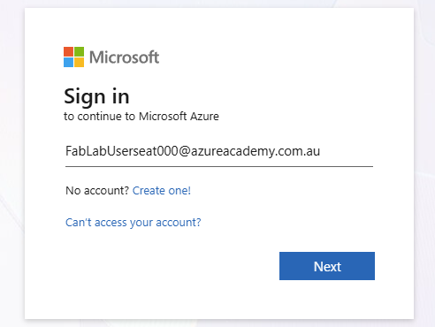
2. Continue through the sign-in flow.
3. Enter the password or temporary access pass if your session requires one.

   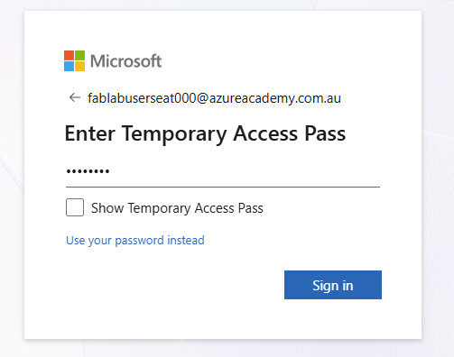

### Step 4 — Handle Any Sign-In Prompts

1. If asked whether to stay signed in, choose the option to stay signed in.

   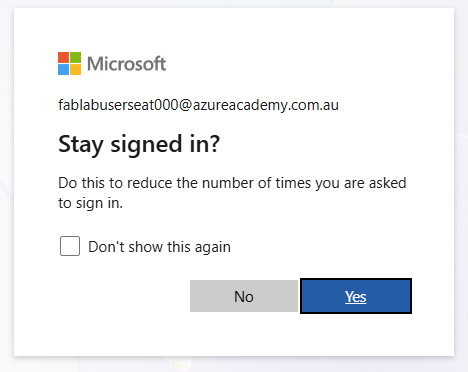
2. If prompted for additional verification, complete it using the lab instructions you were given.
3. If the flow redirects unexpectedly to a personal or company tenant, stop and ask for help. This usually means you are not in an InPrivate or Incognito session, or the lab credentials were not used.

### Step 5 — Confirm You Landed In The Correct Environment

1. Once the portal loads, check the top-right account indicator.

   
2. Confirm the displayed account is your lab user.
3. Stay in this same browser session for the rest of the workshop.

> **What success looks like:** You are signed in to Azure with your lab account and can reach the portal home page.

## ✅ You're Ready

You are now signed in correctly and ready to verify access to the workshop resources.

## Troubleshooting

| Issue | Resolution |
|---|---|
| Portal opens with the wrong account | Sign out fully, open a new InPrivate or Incognito window, and repeat Lab 0 |
| Sign-in loops or returns to an unexpected tenant | Close the browser window and restart from a clean session |
| You do not know which credentials to use | Use the values shown in the LabDesktops banner or ask the facilitator |
| MFA or temporary access prompt is unclear | Ask the facilitator before guessing or using a personal method |

## Lab 1 — Environment And Access Readiness

## Overview

This lab checks access to the resources you need before the build work starts.

> **Lab duration:** ~10 to 15 minutes  
> **Format:** Portal-based

## What Is Already Prepared For You

The workshop environment should already provide access to:

1. An Azure AI Foundry project.
2. A model deployment in that project.
3. A Microsoft Fabric workspace.
4. A Lakehouse, warehouse, semantic model, or other prepared data asset.

> **Quick troubleshooting check:** If you do not see the expected project, workspace, or resource, first confirm you are still in the same browser session from Lab 0 and signed in as the lab user.

## Step-By-Step Checks

### Step 1 — Confirm You Are Still Using The Lab Account

1. If you are not at the Azure portal, in a browser tab, open:

   ```text
   https://portal.azure.com
   ```

2. Confirm the account in the top-right corner is still your lab account.

   

> **Success criteria:** The displayed identity matches the lab credentials used in Lab 0.

### Step 2 — Confirm Azure AI Foundry Access

1. Open a new tab in the same browser session and go to:

   ```text
   https://ai.azure.com
   ```

   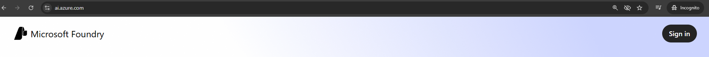

2. If prompted to sign in, use the same lab account.

   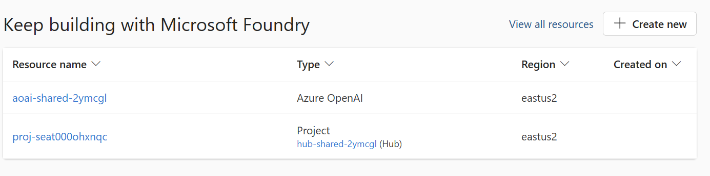
3. Open the project list or all-projects view.
4. Find your assigned project.

   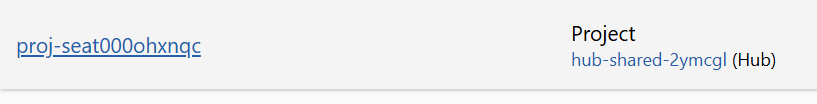
   The project name should align with your lab username. In most cases, the three-digit number in your account matches the `NNN` portion of a name such as `proj-seatNNN`.

> **Naming note:** In many workshops, your project name includes your username or student number. Use the exact project name shown in the event instructions.

5. Open the project by clicking its name.

   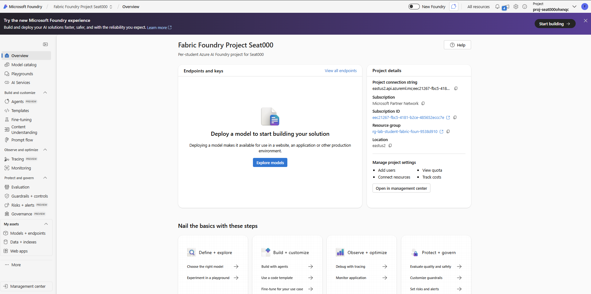

> **Success criteria:** You can enter the project and see navigation items such as **Agents**, **Playgrounds**, **Models + endpoints**, and **Files**.

### Step 3 — Confirm The Model Deployment Exists

1. Inside the project, open **Models + endpoints**.

   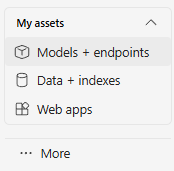
2. Confirm at least one model deployment is available.

   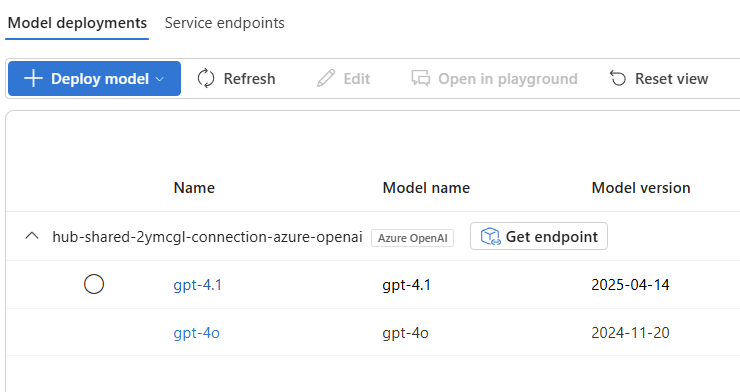


> **Success criteria:** You can see at least one deployment in a healthy state such as **Succeeded**, **Ready**, or equivalent.

### Step 4 — Confirm Microsoft Fabric Access

1. In the same browser session, open:

   ```text
   https://app.fabric.microsoft.com
   ```

   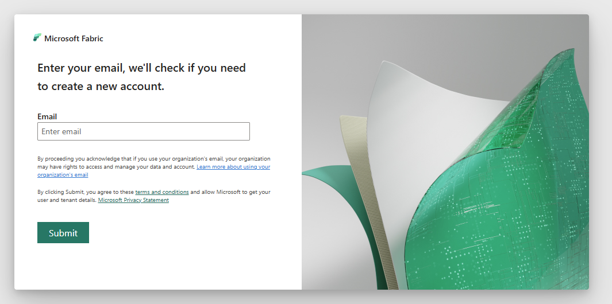

2. If prompted, sign in with the same lab account and click **Submit**.

   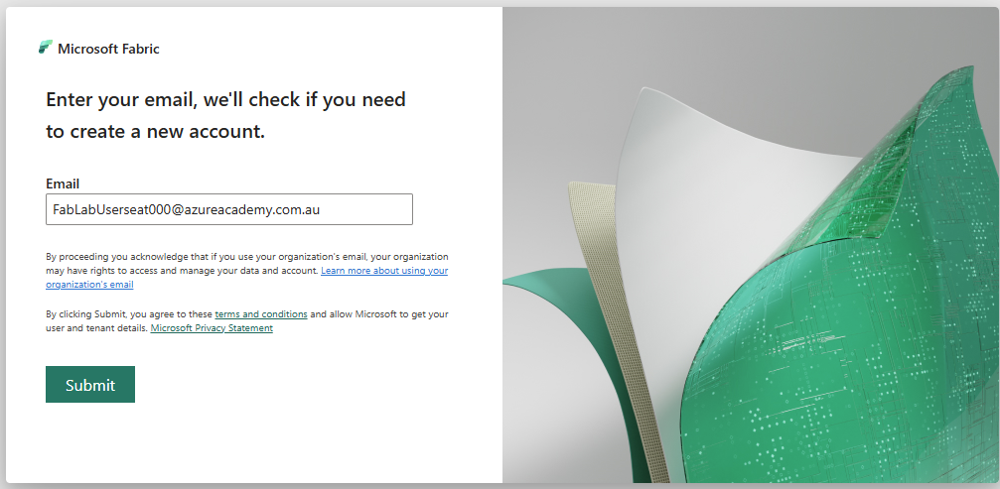
3. If you see this message, do not continue with the sign-up flow.

   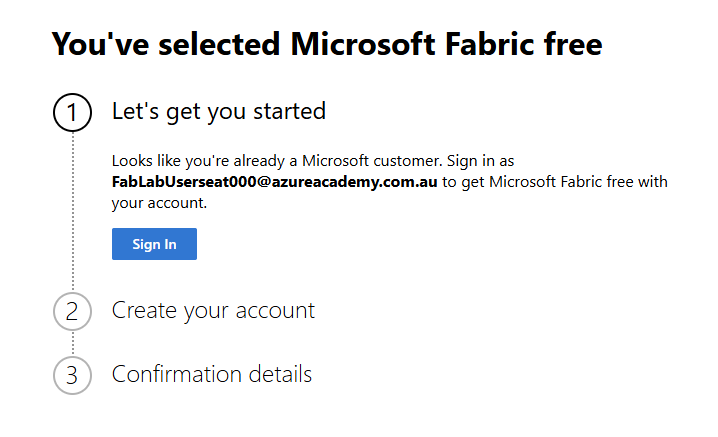
   Instead, navigate to:

    ```text
   https://app.fabric.microsoft.com
   ``` 
   again in the same browser session. You should then land on the Fabric home page.

   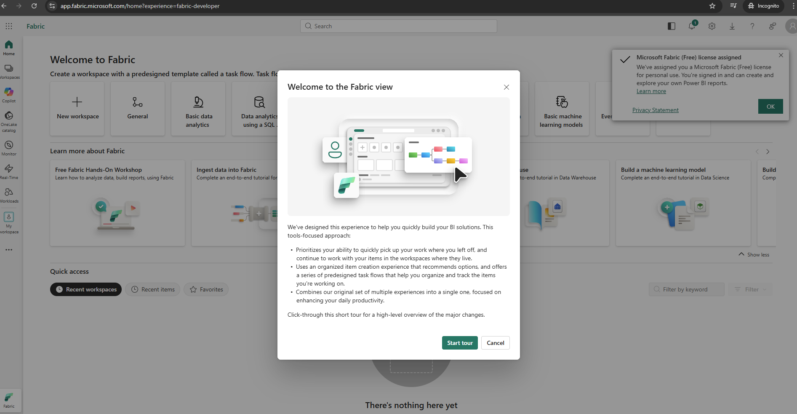
4. You may choose cancel to skip the tour.
5. Open **Workspaces**.

   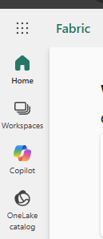
6. Locate the workspace assigned for the event.

   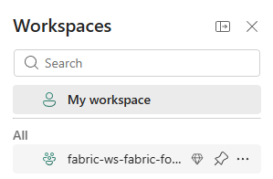

   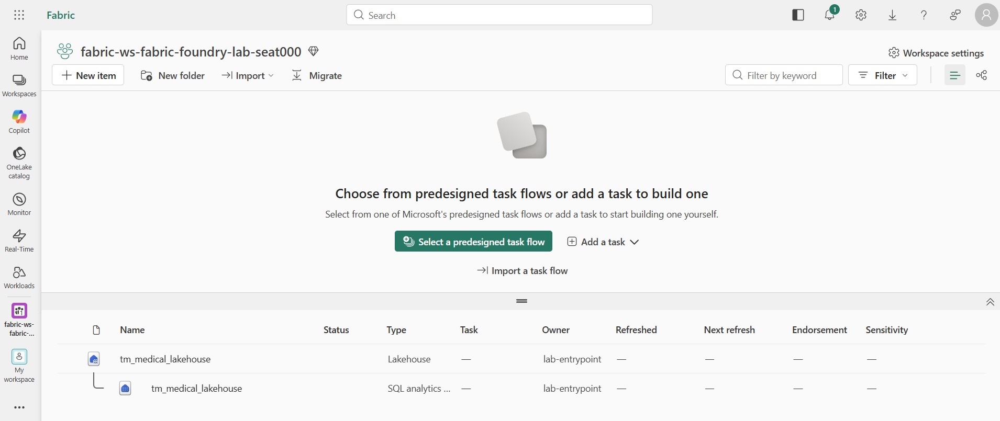

> **Success criteria:** You can enter the workspace and see the prepared items.

### Step 5 — Confirm The Data Asset Is Visible

1. Open the workshop Lakehouse.

   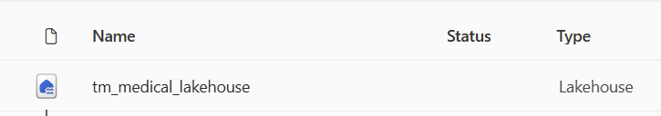
2. Confirm you can see the expected tables, views, or entities.

   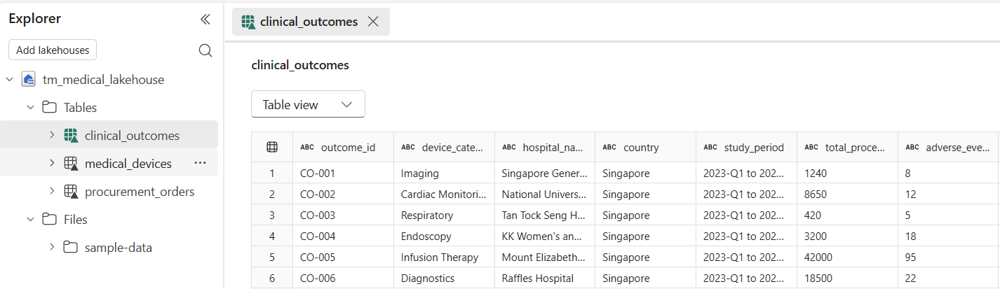
3. Preview at least one table or item.

> **Success criteria:** You can browse the data structure. Read access is enough for this step.

## ✅ Lab Complete

If all five checks succeeded, you are ready to start building.

## Troubleshooting

| Issue | Resolution |
|---|---|
| Cannot see your Foundry project | Confirm you are signed in with the lab account, then ask the support team to verify access |
| No model deployments appear | The deployment may still be provisioning or may use a different name; ask the facilitator to confirm |
| Cannot access the Fabric workspace | Ask the support team to verify your Fabric permissions |
| Data tables or artifacts are missing | Ask the support team to confirm the correct workspace and that sample data is loaded |

## Lab 2 — Build And Ground An AI Agent

## Overview

In this lab you will create a healthcare operations assistant in Azure AI Foundry. You will test it first without grounding, then improve it by attaching the workshop knowledge file.

> **Lab duration:** ~60 minutes  
> **Format:** Portal only  
> **Core goal:** Create an agent, give it clear instructions, attach the workshop knowledge file, and observe how grounded answers improve.

> **Student mindset for this lab:** Move slowly and confirm each save step. In Foundry, most problems come from being in the wrong project, choosing the wrong model deployment, or forgetting to save after editing the agent.

## Before You Start

You should already have:

1. Completed Lab 0 and Lab 1.
2. Access to your assigned Foundry project.
3. Access to the shared model deployment for the workshop.
4. The workshop knowledge file name from your facilitator or event notes.

The lab scenario for the sample prompts in this guide is a healthcare procurement and outcomes assistant. The prepared Fabric data includes medical devices, procurement orders, and clinical outcomes.

## What You Will Build

By the end of this lab, you should have:

1. A saved Foundry agent.
2. A first set of baseline answers from the agent before grounding.
3. A workshop knowledge file attached to the agent.
4. A second set of answers that are more specific and better aligned to the scenario.

## Part 1 — Open Your Foundry Project

### Step 1 — Open Azure AI Foundry

1. In the same browser session you used in Lab 0, open:

   ```text
   https://ai.azure.com
   ```

2. If you are prompted to sign in, use the same lab account.
3. Wait for the home page to finish loading.

> **What success looks like:** You can see the Azure AI Foundry home page.

> **Screenshot to add later:** Foundry home page after sign-in.

### Step 2 — Open Your Assigned Project


If you already see the project page shown below, you are in the correct place and can continue to the next step.

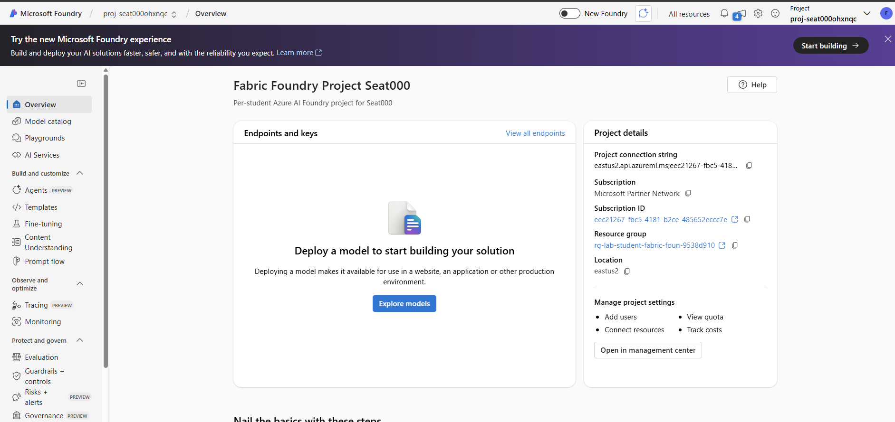

If you see the top-level Foundry resource list instead, use it to locate your assigned project.

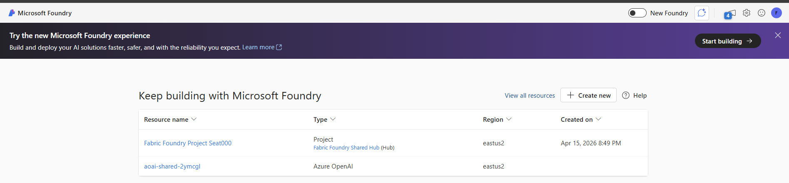


1. Find the project assigned to you for the lab in the list of resources, it will contain the 3 digits like your user account.
2. Open the project.
3. Pause for a moment and review the left navigation.

The project name should include the same three-digit identifier as your lab account.

You should be able to find areas such as:

1. **Agents**
2. **Models + endpoints**
3. **Files**
4. **Playgrounds**

 


> **What success looks like:** You are inside your project and can move around the main sections.

### Step 3 — Confirm The Workshop Model Deployment

1. In the left navigation, open **Models + endpoints**.
2. Find the model deployment specified for the workshop **gpt-4o**.
3. Confirm the deployment status is **Succeeded**.
4. If more than one deployment is listed, note the exact deployment name you should use.

> **What success looks like:** You can identify the correct deployment for the rest of the lab.

> **If you are unsure:** Stop here and ask the facilitator which deployment name to use before creating the agent.

## Part 2 — Run A Baseline Model Test

### Step 4 — Open A Chat Playground

1. Open the chat playground area in Foundry.

   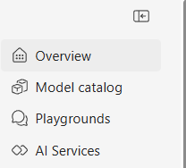
2. Choose **Chat Playground**.

   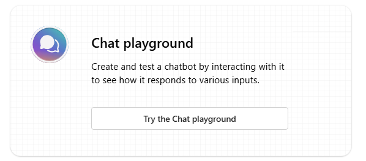
3. Choose the workshop model deployment.

   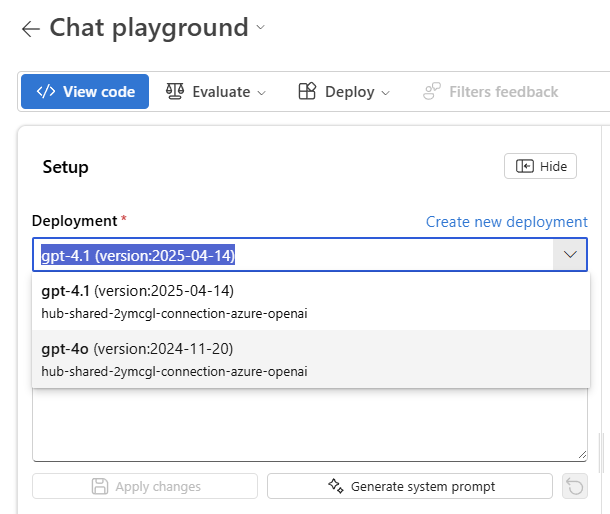
4. Wait until the test surface is ready for input.

### Step 5 — Ask A Baseline Question

1. Enter one of the following prompts.

   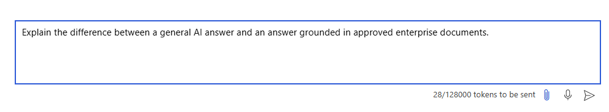
2. Submit it and read the answer carefully.
3. Notice that the answer is still general because you have not created or grounded an agent yet.

Example prompt:

```text
Explain the difference between a general AI answer and an answer grounded in approved enterprise documents.
```

Optional second prompt:

```text
What should an enterprise assistant do when it does not have enough information to answer confidently?
```

> **What success looks like:** You receive a reasonable answer, but it is not specific to the workshop scenario.

## Part 3 — Create Your Agent

### Step 6 — Open The Agents Area

1. Return to the main project navigation.

   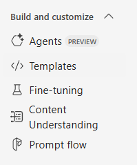
2. Click **Agents**.
3. Select the Azure OpenAI resource, then choose **Let's go**.

   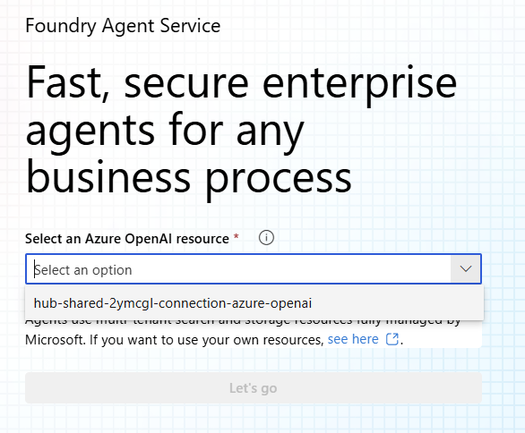
4. Choose the model deployment **gpt-4o**.

   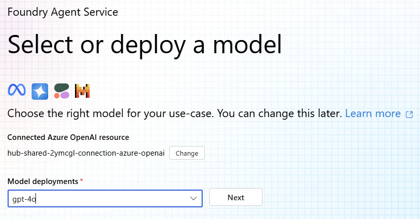
5. A **New agent** is then created for you.
   
> **What success looks like:** The agent creation form opens.

> **Screenshot to add later:** New agent form with key fields highlighted.

### Step 7 — Enter The Agent Name

1. In the **Name** field, enter a clear name for your agent. You cannot change the ID, but you can change the display name.
2. Set the name to something you will recognize later.

   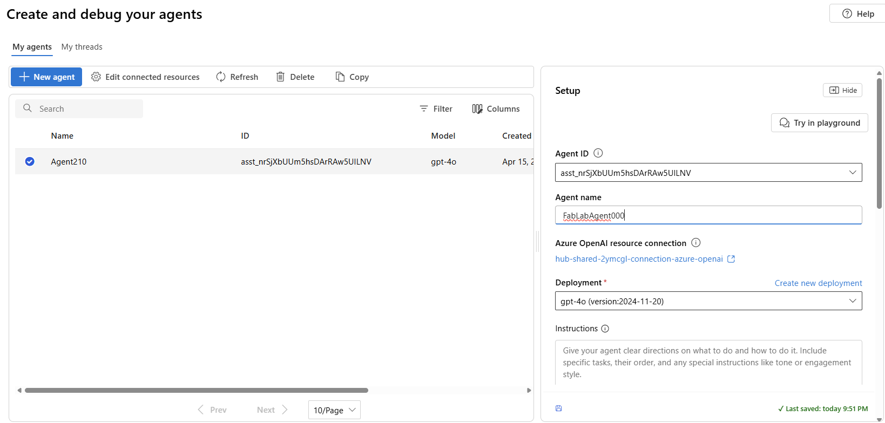

Example:

```text
FabLabAgent-seatNNN
```

> **Why this matters:** A clear name makes it easier to find the agent again when several students are working in the same workshop format.

### Step 8 — Select The Model Deployment

1. Open the **Model** or **Model deployment** selector.
2. Choose the workshop deployment you confirmed earlier.
3. Double-check that you did not accidentally choose a different model.

> **What success looks like:** The correct deployment name appears in the agent configuration.

### Step 9 — Add The Agent Instructions

1. Click into the **Instructions** field.
2. Paste the starter instructions below.
3. Read them once before saving so you understand what behaviour you are defining.

Starter instructions:

```text
You are a healthcare operations assistant for a workshop scenario.
Help users understand prepared information about medical devices, procurement activity, and clinical outcomes.
Use the approved workshop knowledge when it is available.
Be clear, concise, and professional.
If you do not have enough information, say so clearly.
Do not invent facts, metrics, policies, or recommendations.
```

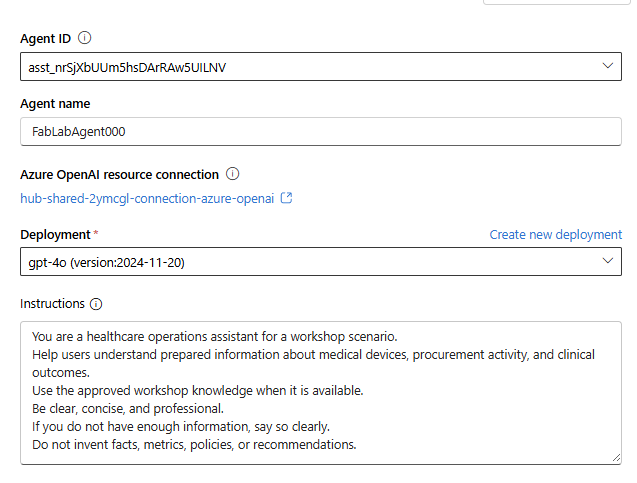

> **What these instructions do:** They define the role, scope, tone, and limits of the agent.

> **Note:** The agent will save automatically.

## Part 4 — Test The Ungrounded Agent

### Step 11 — Open "Try In Playground"

1. Open the test panel, chat panel, or playground for the agent you just saved.

   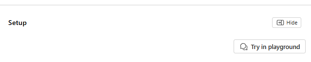
2. Confirm you are testing the saved agent, not the **Chat Playground** from earlier.

   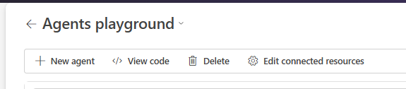

### Step 12 — Ask Two Scenario Questions

1. Ask the first question below.

   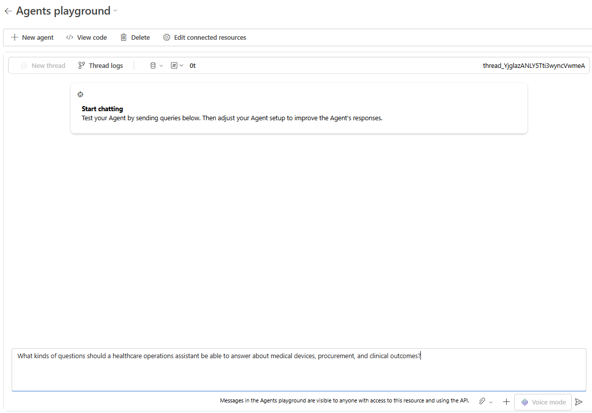
2. Read the answer and decide whether it feels specific or still fairly generic.
3. Ask the second question below.
4. Compare the two responses.

Prompt 1:

```text
What kinds of questions should a healthcare operations assistant be able to answer about medical devices, procurement, and clinical outcomes?
```

Prompt 2:

```text
When should this assistant decline to answer instead of guessing?
```

> **What success looks like:** The agent responds correctly, but the answers still sound broad because the agent only has your instructions and model knowledge so far.

### Step 13 — Record One Observation

Write down one short observation before moving on.

Examples:

1. The answer was well-structured but too general.
2. The answer sounded reasonable, but it had no workshop-specific detail.
3. The answer described safe behaviour clearly.

> **Why this matters:** In the next section, you will compare grounded responses to these baseline answers.

## Part 5 — Upload The Workshop Knowledge File


### Step 14 — Upload The Knowledge File

1. Select the **Knowledge** area and choose **Add**.

   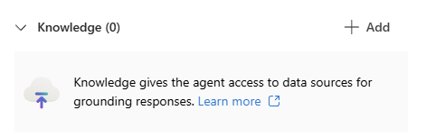

2. Choose the **Files** option to upload a document as a knowledge source.

   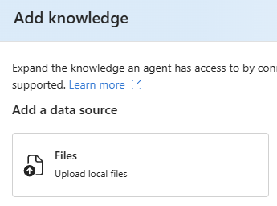

3. Click **Select Local Files**.

   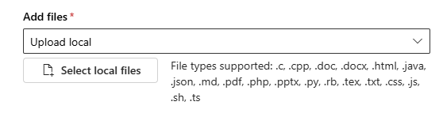

4. Select the workshop knowledge file. If you do not already have it on your machine, download it from [Sample Knowledge.docx](https://github.com/LukeDuffy98/Microsoft-Fabric-And-Databases/raw/refs/heads/main/labs/fabric-foundry-lab/assets/Sample%20Knowledge.docx).

   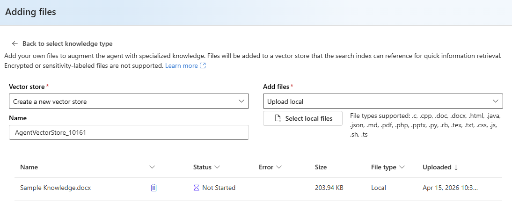

5. Select **Upload and save**.

   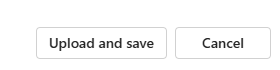

6. Wait for processing to complete.

> **Important:** Use the exact workshop file provided by the facilitator. Do not upload a random document just to move forward.

> **What success looks like:** The file appears in the list with a status such as **Ready**.

> **Screenshot to add later:** Files view showing uploaded knowledge file in ready state.


## Part 6 — Test The Grounded Agent

### Step 14 — Ask A Grounded Question

1. Open the agent test panel again.
2. Ask a question that should benefit from the workshop document.
3. Read the answer carefully.
4. Notice that these answers come from the uploaded file and may not align with the healthcare scenario used earlier. This is expected, and it shows that the agent is relying on the document rather than its earlier scenario instructions or general model knowledge.

Try this prompt first:

```text
You are a Contoso Retail support agent. Using only the uploaded “Contoso Retail – Internal Knowledge” document, answer this customer:

“I live in a regional area—how long should delivery take, and what happens during peak periods?”

Requirements:

Include the exact delivery timeframe ranges for regional (and optionally metro/remote for comparison).
Mention peak period impact exactly as stated.
If the document doesn’t specify something, say: “Not specified in the knowledge file.”
```


Then try this prompt:
```text
You are a Contoso Retail agent. A customer returned an item and says:

“It’s been 8 business days since you received my return and I still don’t have my money. What’s the process and when do you escalate?”

Requirements:

State the refund processing time after return received and the bank posting time.
Tell them the total possible time window implied by the doc.
State the rule for escalation to Finance (the “more than 10 business days since processing” condition).
```


Then try this prompt:
```text
You are a Contoso Retail support agent. A person claims to be the customer’s partner and asks for order details. Create a response that follows the knowledge file.
Requirements:

List the minimum verification approach from the document (two identifiers + examples).
Include at least two “Don’t”/restriction statements from the privacy section.
If the requester can’t be verified, clearly state what you can and can’t share based on the document (don’t invent extra policy).
```

### Step 15 — Ask A Boundary Question

1. Ask a second question that tests whether the agent can separate document knowledge from live data.

Use this prompt:

```text
Which questions can you answer from the knowledge file alone, and which questions would still require live Fabric data?
```

> **What success looks like:** The answers are more specific than before and clearly reference the limits of the current setup.

### Step 16 — Compare Before And After

1. Compare one of your grounded answers with one of your earlier ungrounded answers.
2. Identify one improvement.
3. Identify one limitation that still remains.

Examples:

1. Improvement: the answer is more specific to the workshop.
2. Limitation: the agent still cannot answer current data questions.

## Part 7 — Optional Refinement

### Step 17 — Optional: Tighten The Instructions

If time allows:

1. Return to the agent instructions.
2. Add one more line that improves caution or clarity.
3. Save the agent.
4. Re-run one earlier question.

Example line:

```text
If a user asks for a current metric or value, explain that live data access is required.
```

### Step 18 — Optional: Review Trace Or Usage Views

If trace or monitoring features are available in your environment:

1. Open the relevant trace, monitoring, or usage page.
2. Review how one response was produced.
3. Note why this could matter for debugging or governance.

## ✅ Lab Complete

You have successfully:

- [x] Opened your assigned Foundry project
- [x] Confirmed the workshop model deployment
- [x] Created and saved a healthcare operations agent
- [x] Tested the agent before grounding
- [x] Uploaded and attached the workshop knowledge file
- [x] Observed an improvement in grounded responses
- [ ] *(Optional)* Refined the instructions further
- [ ] *(Optional)* Reviewed trace or usage details

## Key Takeaways

1. Instructions define the role and guardrails.
2. Knowledge grounding improves relevance and specificity.
3. The agent still cannot answer live operational questions until you add a data-backed tool.

## Troubleshooting

| Issue | Resolution |
|---|---|
| Cannot find your Foundry project | Confirm you are still signed in with the lab account and ask support to verify access |
| The workshop deployment is missing | Confirm the expected deployment name with the facilitator |
| The agent save does not appear to stick | Wait for the save to finish, then reopen the agent and verify the values |
| File upload fails | Retry after the project fully loads and confirm you are in the correct project |
| The file is uploaded but not usable | Wait until the file status becomes ready before attaching it |
| The agent does not seem grounded | Reopen the agent and confirm the knowledge source is still attached after save |

## What's Next?

In the next lab you will add live Microsoft Fabric data so the agent can answer questions about medical devices, procurement orders, and clinical outcomes using structured data rather than only instructions and documents.

## Lab 3 — Connect Live Fabric Data

## Overview

In this lab you will connect your Foundry agent to real workshop data in Microsoft Fabric. The goal is to move from static knowledge to live, structured answers.

> **Lab duration:** ~75 minutes  
> **Format:** Portal-based  
> **Core goal:** Get at least one response from your agent that clearly depends on live Fabric data.

> **Student mindset for this lab:** First prove that the Fabric data experience works on its own. Then add it to your agent. Do not try to debug both at once.

## Before You Start

You should already have:

1. Completed Lab 2.
2. A saved Foundry agent.
3. Access to the workshop Fabric workspace.
4. Access to the shared Fabric data experience provided for the event.

The prepared sample data for this workshop includes:

1. Medical devices
2. Procurement orders
3. Clinical outcomes

## Part 1 — Open The Fabric Workspace

### Step 1 — Open Microsoft Fabric

1. In the same browser session from Lab 0, open:

   ```text
   https://app.fabric.microsoft.com
   ```

2. Sign in with the lab account if required.
3. Wait for the Fabric home page to load.

> **What success looks like:** You can see the Fabric landing page.

### Step 2 — Open The Workshop Workspace

1. Click **Workspaces**.
2. Find the workspace assigned for the workshop.
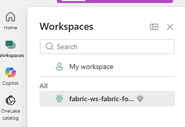

3. Open it.
4. Review the item list before clicking anything else.

You may see items such as:

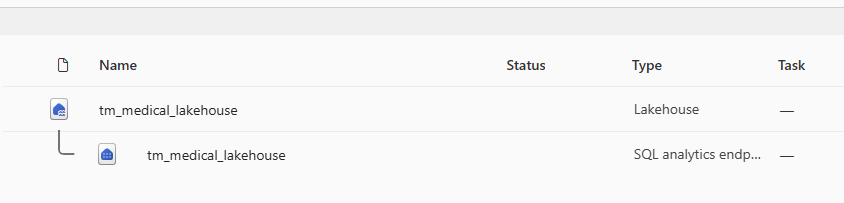

> **What success looks like:** You are inside the correct workspace and can see the prepared assets.


### Step 3 — Inspect The Main Data Asset

1. Open the primary Lakehouse.
2. Find the available tables, views, or entities.
3. Preview at least one item.
4. Look for names related to medical devices, procurement orders, or clinical outcomes.
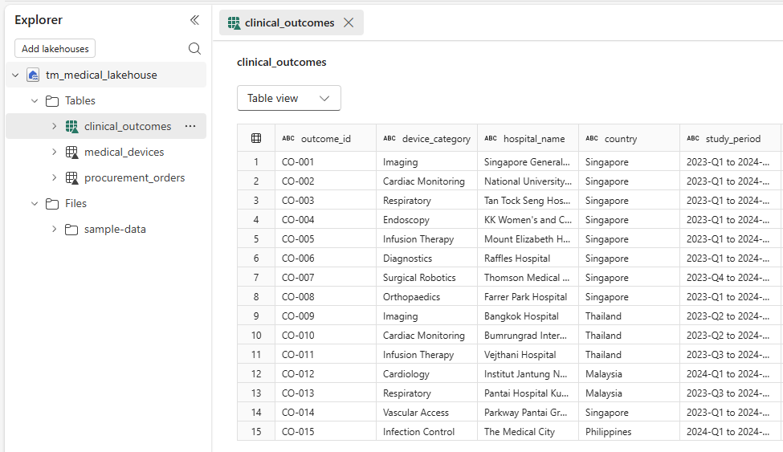

> **What success looks like:** You can explain what kind of business information the workspace contains.


## Part 2 — Create Fabric Data Agent

### Step 4 — Open The Shared Data Agent Or Equivalent Experience

1. Return to the workspace item list by closing the lakehouse.
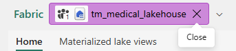

2. Select **New Item**
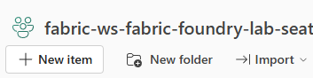

3. Find the Data Agent item.
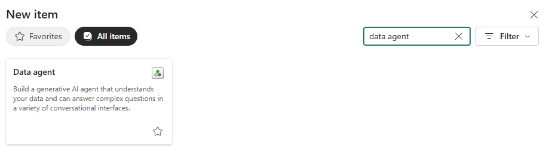

4. Add a name for datagent such as `FabLabDataAgent-NNN` where NNN is lab number.
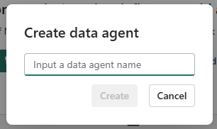

5. Skip the tour

6. Select **Add Data** and choose "Data Source"
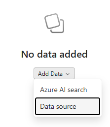

7. Select your Lakehouse and choose **Add**
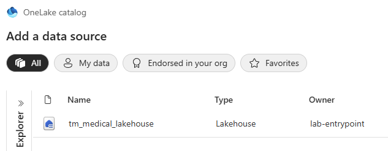

8. Then select all 3 table
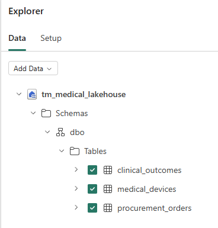


### Step 5 — Ask A Simple Data Question

1. Ask a question that should be answerable from the prepared data.
2. Read the answer.
3. Decide whether the answer sounds data-backed.

Try this prompt first:

```text
What types of information are available in this workshop dataset?
```
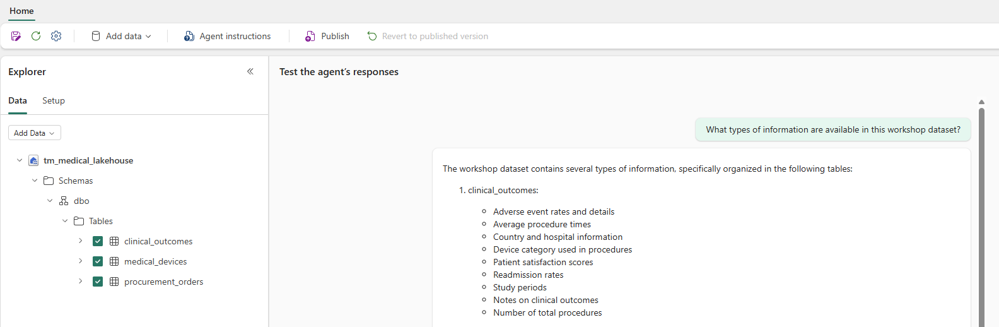


> **Note** the table names, categories, or values mentioned in the answer. This indicates the agent is using the data rather than just general knowledge.

### Step 8 — Ask A Scenario Question

1. Ask a second question that reflects the healthcare scenario.
2. Read the answer and note whether it references categories, hospitals, or values.

Try one of these prompts:

```text
Which device categories appear in the available healthcare data?
```

```text
Summarize the kinds of procurement and clinical outcome questions this dataset could support.
```

> **What success looks like:** You receive at least one useful answer that clearly comes from the workshop data experience.

> **Note** You can also add custom instructions, data source instructions and example queries. Play around with the experience if you have time, but be sure to at least get a clear data-backed answer before moving on.

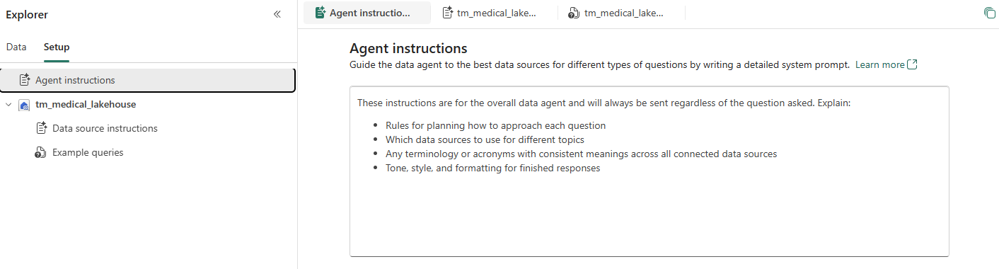

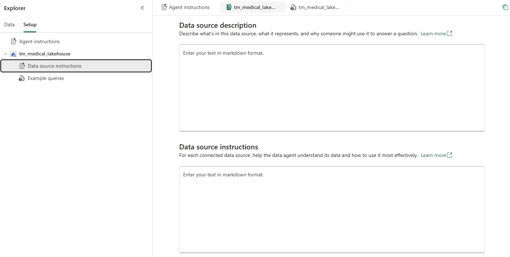

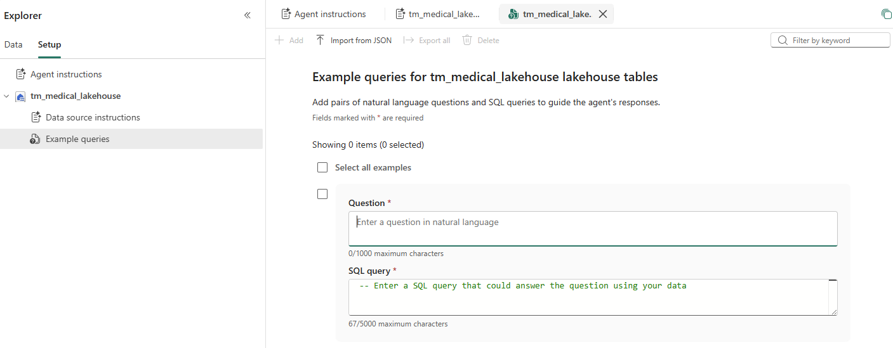

### Step 9 — Publish your Data Agent

1. Choose the publish option from the ribbon
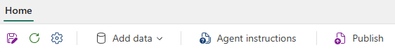


2. Then select publish. Do not change any settings 
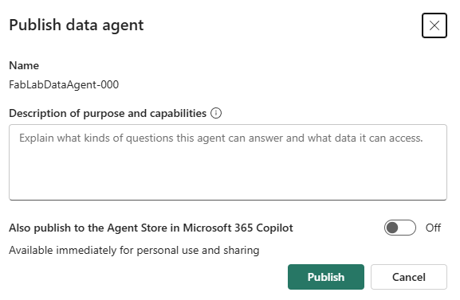

3. After publishing choose the settings gear on the ribbon.
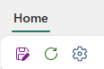

4. Copy the **Published URL** and save it for the next section.
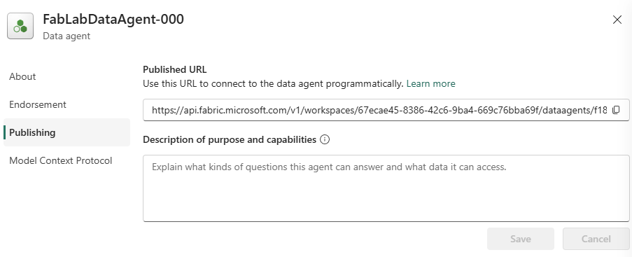

You will need to copy the workspace value (Between workspace/ and /agent in the URL) and the agent value (after /agent/) to connect this data agent to your Foundry agent in the next section.


## Part 3 — Add The Fabric Capability To Your Foundry Agent

### Step 10 — Return To Azure AI Foundry

1. Go back to the browser tab where your Foundry project is open.
2. Open **Agents**.
3. Select the agent you created in Lab 2.

### Step 11 — Open The Knowledge Section

1. In the knowledge section, choose to add a new knowledge source.
2. Choose **Microsoft Fabric**
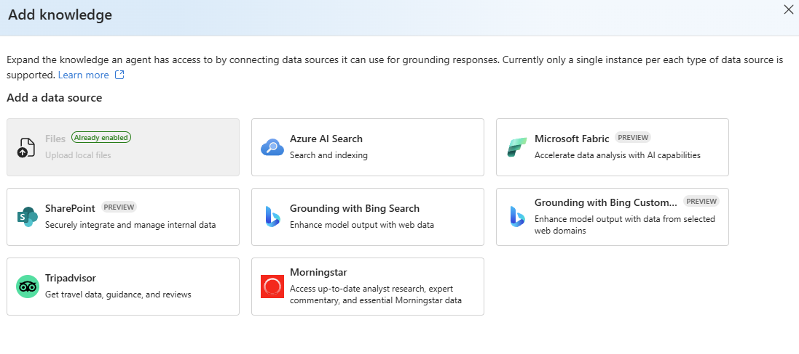

3. Choose the option to **create connection**.
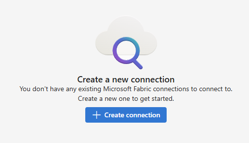

4. Set the workspace-id and artifact-id using the values in the published URL from the previous section. The workspace-id is the value between workspace/ and /agent in the URL, and the artifact-id is the value after /agent/ in the URL.
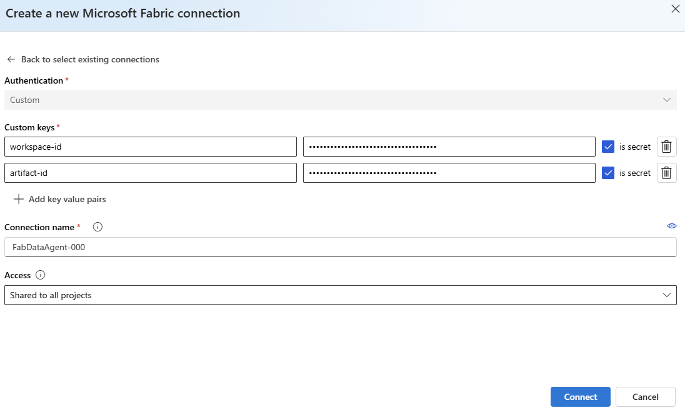

5. Set the connection name to something recognizable such as `FabLabDataAgent-NNN Connection`.

6. Then choose **Connect**


### Step 11 — Update The Instructions So The Agent Uses The Tool

1. Return to the **Instructions** field.
2. Add the text below at the end of your existing instructions. **Keep the original instructions, we are appending new guidance.**
3. Save the agent again.

Suggested addition:

```text
When a user asks about current or structured workshop data, use the configured Fabric data tool.
Use the tool for questions about device categories, procurement activity, hospitals, quantities, costs, and clinical outcomes.
Do not estimate values when the tool can retrieve them.
If the tool does not return enough information, say that clearly.
```

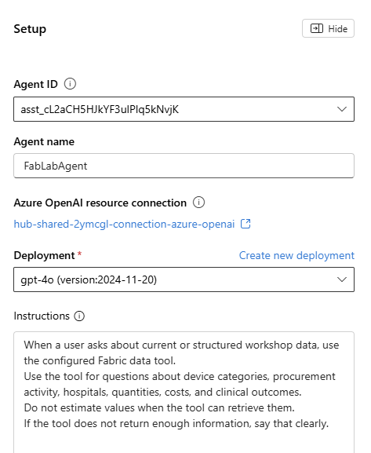

> **Why this step matters:** Adding a tool is not enough on its own. The instructions help the agent know when it should use the tool.

## Part 4 — Test The Data-Enhanced Agent

### Step 12 — Ask A Live Data Question


1. Ask a question that should require live structured data.
2. Read the answer carefully.

Try this prompt first:

```text
Using the available Fabric data, summarize the main types of healthcare information this assistant can now answer questions about.
```
> **Note** the file source is used to return data-backed answers rather than just general knowledge or Fabric Data.

### Step 13 — Ask A More Specific Question

1. Ask a second question that should force the agent to use the Fabric capability.
2. Look for evidence that the answer is more concrete than the grounded-only answers from Lab 2.

Try one of these prompts:

```text
Use the live data to explain how medical devices, procurement orders, and clinical outcomes relate to each other.
```

> **Note** the Fabric source is used to return data-backed answers.

```text
Based on the current data, what kinds of hospital operations insights could this assistant support?
```

> **What success looks like:** The response is more specific and sounds clearly tied to structured data rather than only general instructions.


## Part 5 — Optional Extension Work

### Step 14 — Optional: Ask A Deeper Analytical Question

If time allows, try a prompt that combines reasoning with data access.

Examples:

```text
Based on the available workshop data, what is one operational insight a hospital leader might want to investigate further?
```

```text
Use the live data to describe one relationship between device usage, procurement, or outcomes that could matter to decision-makers.
```

### Step 15 — Optional: Revisit The Fabric Workspace

1. Return to Fabric.
2. Open another table, entity, or report.
3. Note one additional question that would be useful in a real healthcare operations workflow.

### Step 16 — Optional: Note One Production Gap

Write down one thing that would need improvement before this assistant could be used in a real production setting.

Examples:

1. Better access controls
2. Cleaner data definitions
3. Stronger evaluation and validation
4. More explicit citation or traceability

## ✅ Lab Complete

You have successfully:

- [x] Opened the workshop Fabric workspace
- [x] Tested the shared Fabric data experience
- [x] Added a Fabric-backed capability to your Foundry agent
- [x] Updated the instructions so the agent knows when to use the tool
- [x] Verified at least one live-data response
- [ ] *(Optional)* Asked a deeper analytical question
- [ ] *(Optional)* Identified a production improvement area

## Key Takeaways

1. Knowledge files provide context, but live data provides factual depth.
2. The agent needs both the tool connection and the instruction update.
3. A useful assistant combines role instructions, grounded knowledge, and controlled access to structured data.

## Troubleshooting

| Issue | Resolution |
|---|---|
| Cannot access the Fabric workspace | Confirm you are in the same browser session and ask support to verify access |
| Cannot find the shared Fabric data experience | Ask the facilitator for the exact item name used in your environment |
| The Foundry agent is not using the tool | Recheck the tool attachment and confirm the instruction update was saved |
| The answer still sounds generic | Ask a more data-specific question and strengthen the instruction telling the agent to use the Fabric tool |
| Responses are slow | Shared lab environments can be slower than normal; wait and retry |

## What's Next?

The final lab is a short review where you will capture what changed at each stage: base model, configured agent, grounded agent, and data-enhanced agent.

## Lab 4 — Wrap-Up And Review

## Overview

This final lab is a structured review. Your goal is to summarize what you built and explain how each layer improved the assistant.

> **Lab duration:** ~10 to 15 minutes  
> **Format:** Review and discussion

## Step-By-Step Review

### Step 1 — Reopen Your Agent

1. Return to Azure AI Foundry.
2. Open your saved agent.
3. Confirm you can still see the instructions, the knowledge source, and the Fabric-backed tool.

### Step 2 — Summarize The Four Stages

Using your own words, describe what changed at each stage:

1. Base model only
2. Agent with instructions
3. Agent with knowledge grounding
4. Agent with live Fabric data

### Step 3 — Capture One Example For Each Stage

If time allows, note one example of a question suited to each stage.

Examples:

1. Base model only: general explanation questions
2. Agent with instructions: role-specific safe behaviour questions
3. Grounded agent: workshop-document questions
4. Data-enhanced agent: structured healthcare data questions

### Step 4 — Identify One Real-World Requirement

Write down one thing you would need before using this pattern in a real organization.

Examples:

1. Better governance
2. Stronger evaluation
3. Human review for sensitive answers
4. Clearer source visibility

## Discussion Prompts

Use the remaining time to discuss:

1. What improved when you moved from a base model to an agent?
2. What improved when you added grounding?
3. What improved when you added live data?
4. Which part would require the most engineering work before production use?
5. Which controls would matter most for safety, security, and trust?

## ✅ Workshop Complete

You have now completed a portal-first lab pattern that combines:

- role instructions
- grounded workshop knowledge
- live Fabric data
- student-friendly validation at each stage

## Facilitator Notes For This File

Before the event, replace the placeholder values in this guide with:

1. The final project, deployment, workspace, and tool names.
2. The exact knowledge file name used in Lab 2.
3. The exact Fabric data capability name used in Lab 3.
4. Relative screenshot links from `./assets/` wherever the UI may be hard to recognize.
5. Any event-specific scenario wording that should replace the generic healthcare operations language.